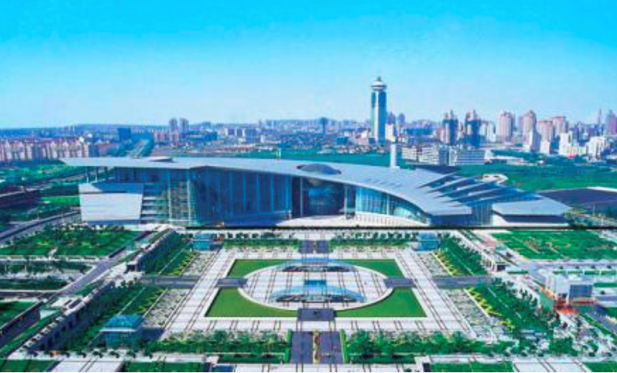

# The Shameless Business Components: A New Perspective in DDD

In the realm of software architecture, the concept of Domain-Driven Design (DDD) has been a beacon for managing complex systems. However, as we dive deeper into this approach, we encounter the fascinating idea of "Shameless Business Components". Inspired by the architectural philosophy of Feng Guochuan, who contrasts "face-keeping" buildings with "shameless" architecture, this concept finds its unique place in DDD.

## Exploring the Architectural Analogy

### Face-Keeping Architecture
Traditional architectures often emphasize grand facades, creating a deliberate distance between the structure and its observers. This approach, while powerful, can create a sense of exclusion and complexity.

### Shameless Architecture
In contrast, "shameless" architecture breaks down the grandeur into accessible, smaller elements. This style promotes inclusivity and simplicity, allowing for more direct interaction and understanding.

## Applying to Business Components

Drawing parallels to software architecture, especially in DDD, we explore how breaking down monolithic systems into smaller, more manageable components can enhance clarity and efficiency. These "shameless" components, akin to microservices, offer a more direct and straightforward approach to handling business logic.

### Interface Transformation
Shifting from large, complex interfaces to smaller, focused ones not only simplifies interactions but also enhances performance and maintainability.

### Internal Logic Harmonization
By adopting object-oriented principles and ensuring high cohesion and low coupling within components, we achieve a more natural and manageable structure in our designs.

In our journey through Domain-Driven Design, we'll delve deeper into these "shameless" components, exploring their structure, functionality, and the benefits they bring to software architecture.
